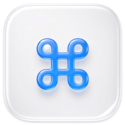
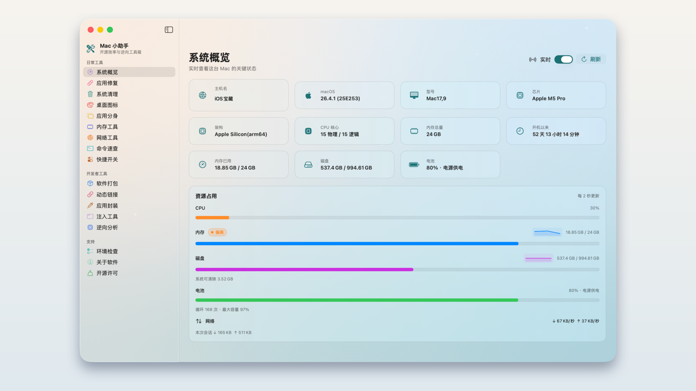
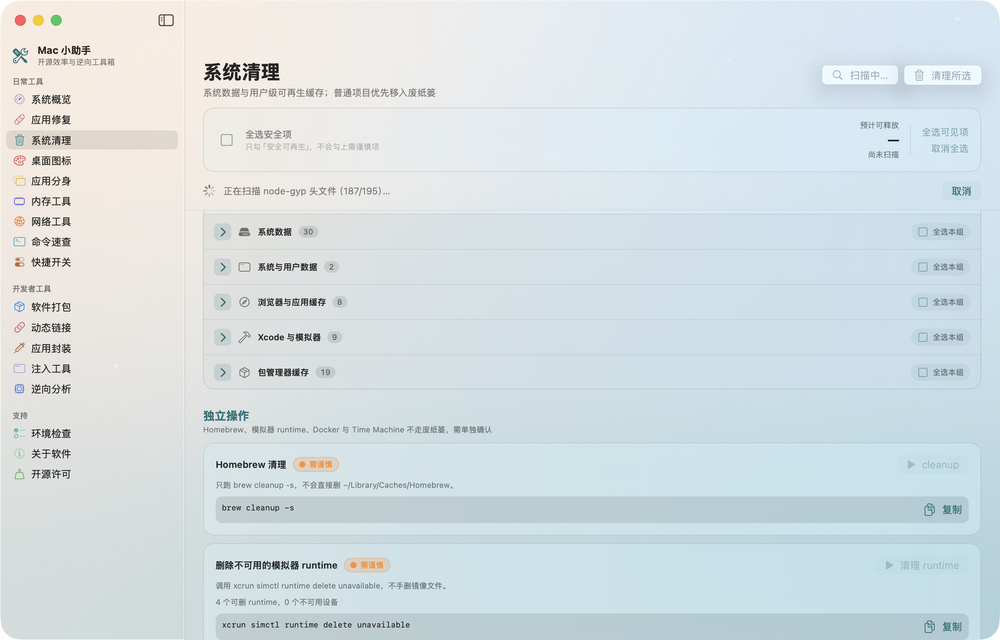
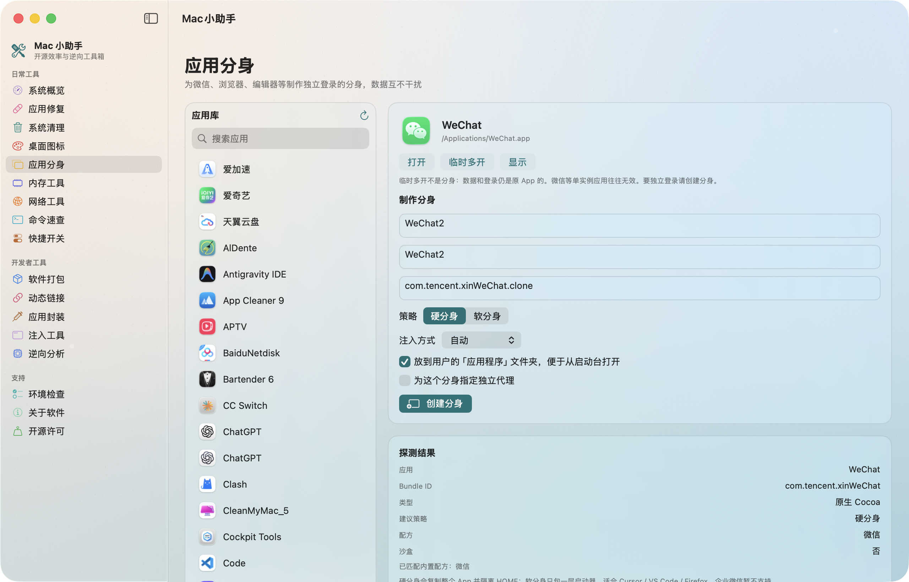
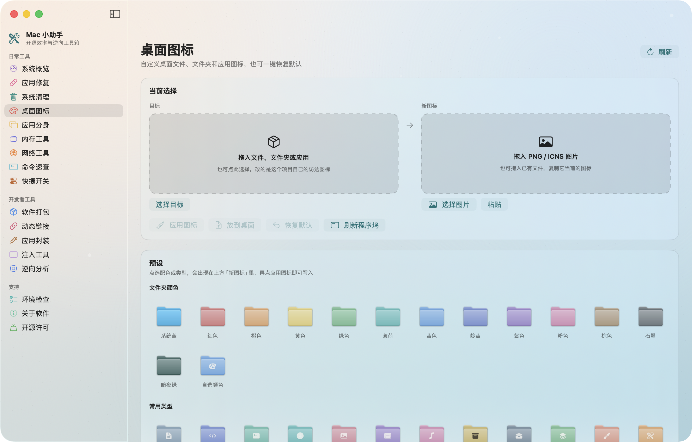
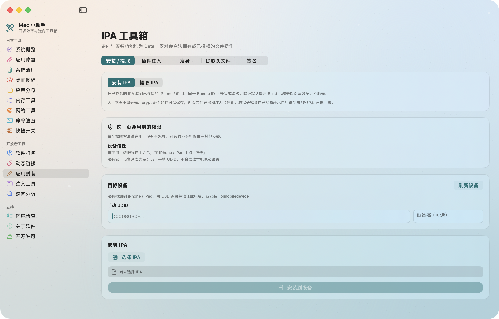
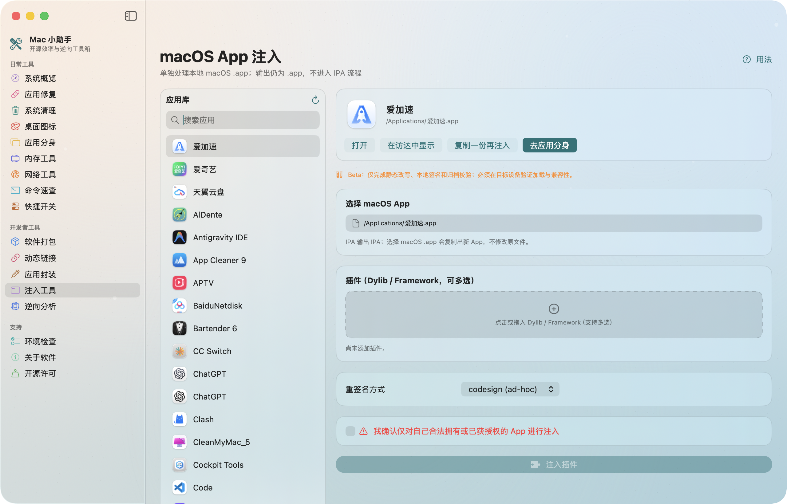
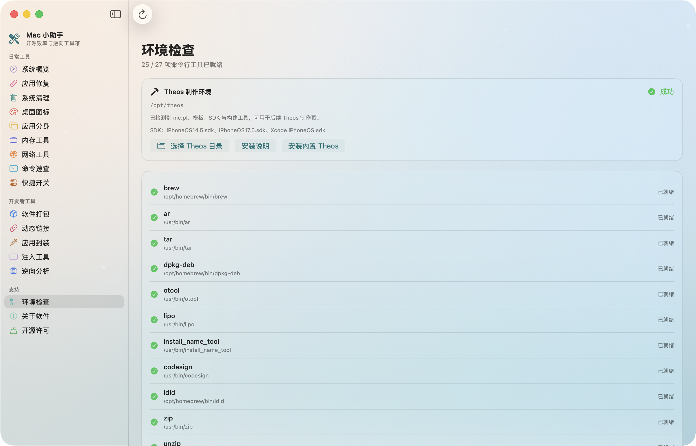

<p align="center">
  
</p>

<h1 align="center">MacAssistant</h1>

<p align="center">
  Нативный набор для macOS: обслуживание, клоны, ремонт приложений, команды и сайдлоад.
</p>

<p align="center">
  <a href="../README.md">English</a>
  · <a href="README.zh-CN.md">简体中文</a>
  · <a href="README.es.md">Español</a>
  · <a href="README.ko.md">한국어</a>
</p>

<p align="center">
  <a href="https://github.com/iosrxwy/MacAssistant/actions/workflows/ci.yml"></a>
  
  
  <a href="../LICENSE"></a>
</p>

<p align="center">
  <a href="https://github.com/iosrxwy/MacAssistant/releases"></a>
  <a href="https://x.com/iOSRXWY"></a>
  <a href="https://t.me/iosrxwy"></a>
</p>

<p align="center">
  
</p>

<p align="center">
  <sub>Живые CPU, память, диск и батарея. Скриншоты на упрощённом китайском; шесть языков — в «О программе».</sub>
</p>

## Основные возможности

<table>
  <tr>
    <td align="center" width="50%" valign="top">
      
      <br>
      <b>Очистка</b><br>
      Кэши, Derived Data, Docker и Time Machine — сначала просмотр. Только домашний каталог.
    </td>
    <td align="center" width="50%" valign="top">
      
      <br>
      <b>Клоны приложений</b><br>
      Изолированные копии WeChat, браузеров и редакторов, с отдельным прокси.
    </td>
  </tr>
  <tr>
    <td align="center" width="50%" valign="top">
      
      <br>
      <b>Значки рабочего стола</b><br>
      Перекраска значков Finder для файлов, папок и приложений.
    </td>
    <td align="center" width="50%" valign="top">
      
      <br>
      <b>IPA-верстак</b><br>
      Внедрение плагинов, сжатие, заголовки, подпись. Beta.
    </td>
  </tr>
  <tr>
    <td align="center" width="50%" valign="top">
      
      <br>
      <b>Внедрение в Mac-приложения</b><br>
      Внедрение dylib в локальный <code>.app</code>. Beta.
    </td>
    <td align="center" width="50%" valign="top">
      
      <br>
      <b>Проверка окружения</b><br>
      Находит недостающие инструменты и подсказывает установку.
    </td>
  </tr>
</table>

### Другие функции

| Повседневное | Разработка |
| --- | --- |
| Ремонт App (повреждено, карантин, подписи) | DEB: создать, проверить, конвертировать, пересобрать |
| Живое давление памяти и процессы | DYLIB: зависимости, install name, rpath |
| Сеть: скорость, порты, ping, DNS, внешний IP | IPA: установка / извлечение как есть (без FairPlay) |
| Поиск команд с метками риска | Mach-O и class-dump |
| Переключатели Finder, скриншотов, скрытых файлов | Послойная подпись и Apple ID |

Предпросмотр перед удалением. Открытый код, без телеметрии.

Фоны, боковая панель, цвет значков и шесть языков — в **«О программе»**.

## Загрузка

[Releases](https://github.com/iosrxwy/MacAssistant/releases) · macOS 13+ · Apple Silicon и Intel.

### macOS блокирует первый запуск?

> [!IMPORTANT]
> Эта версия подписана **ad-hoc и не нотаризована**. Откройте приложение один раз, затем **Системные настройки → Конфиденциальность и безопасность → Всё равно открыть**. Не отключайте Gatekeeper.

## Сборка

```bash
git clone https://github.com/iosrxwy/MacAssistant.git
cd MacAssistant
./build_app.sh release universal
```

## Участники

<table>
  <tr>
    <td align="center" width="120">
      <a href="https://github.com/iosrxwy"></a><br>
      <a href="https://github.com/iosrxwy"><b>iosrxwy</b></a><br>
      <sub>Автор</sub>
    </td>
    <td align="center" width="120">
      <a href="https://github.com/codex"></a><br>
      <a href="https://github.com/codex"><b>Codex</b></a><br>
      <sub>Разработка</sub>
    </td>
    <td align="center" width="120">
      <a href="https://x.ai/grok"></a><br>
      <a href="https://x.ai/grok"><b>Grok Build</b></a><br>
      <sub>Разработка</sub>
    </td>
  </tr>
</table>

Thanks: [AltSign](https://github.com/rileytestut/AltSign) / [AltStore](https://github.com/altstoreio/AltStore) · [xtool](https://github.com/xtool-org/xtool) · [libimobiledevice](https://libimobiledevice.org) · [Theos](https://github.com/theos/theos) · [zsign](https://github.com/zhlynn/zsign) · [ATBClone](https://github.com/aitobox/ATBClone)

[GNU GPL-3.0](../LICENSE). Распространяемые изменения должны оставаться свободным ПО под той же лицензией, с полным соответствующим исходным кодом.

[SECURITY.md](../SECURITY.md)
